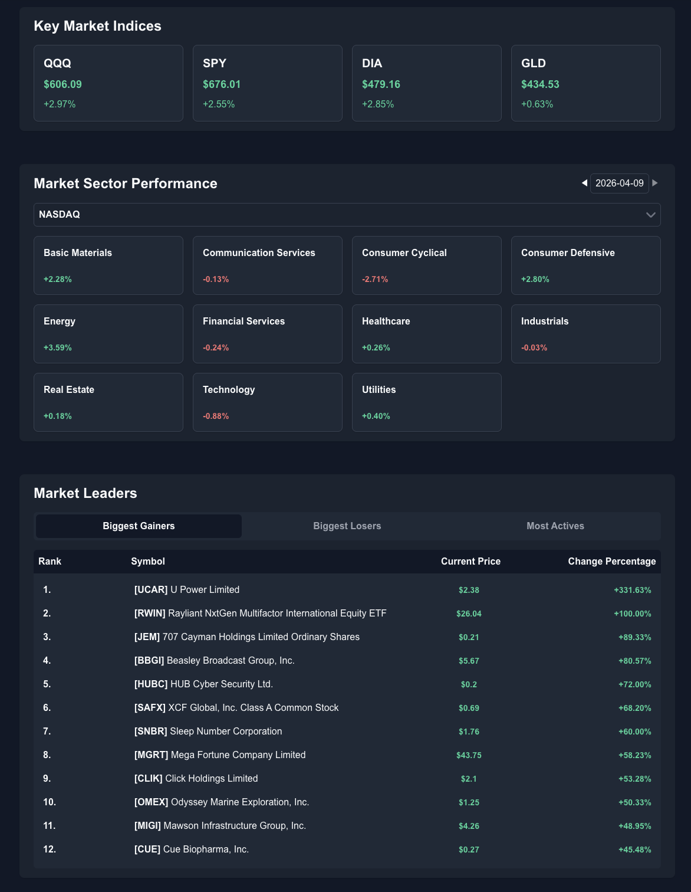
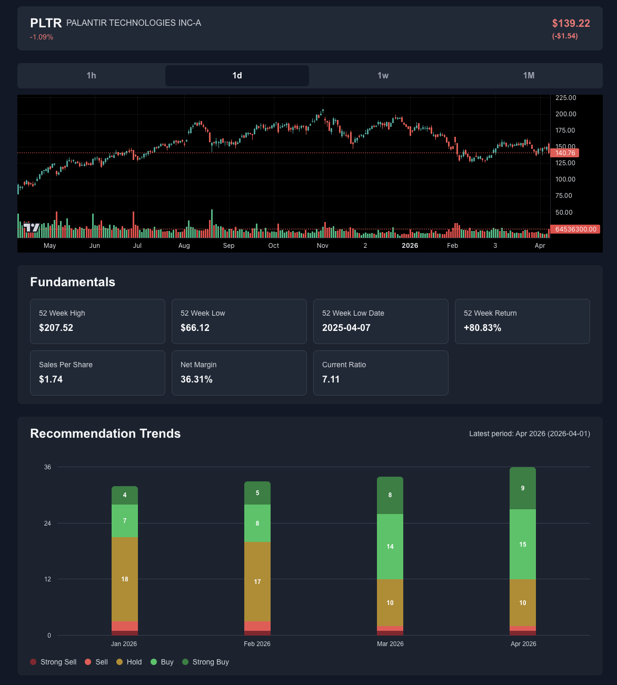
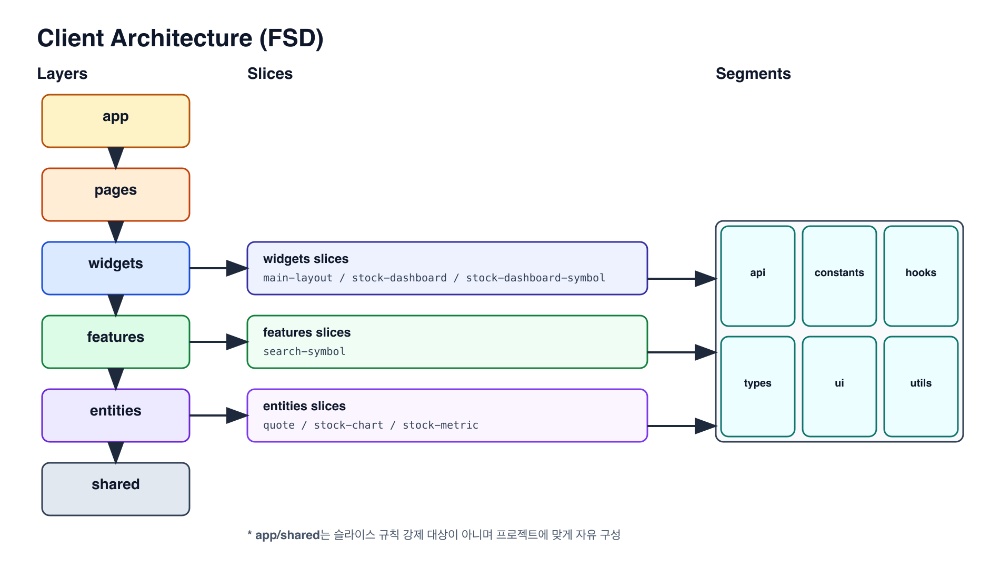
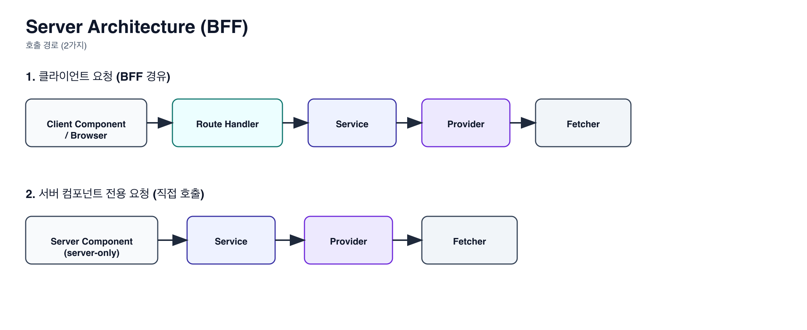

# Stock Watch

- 여러 금융 데이터 API를 통합해 시장 흐름과 개별 종목 정보를 한눈에 탐색할 수 있는 Next.js 기반 주식 대시보드
- BFF + FSD 구조를 기반으로 설계했으며, DIP를 적용한 Provider 추상화를 통해 외부 API 변경에도 유연하게 대응할 수 있도록 구성했습니다.

 

- **인원**: 1인
- **배포**: https://stock-watch-v1.vercel.app/stock-dashboard

 

## 목차

- [🛠 기술 스택](#기술-스택)
- [✨ 핵심 기능](#핵심-기능)
- [🏗 아키텍처](#아키텍처)
- [📊 데이터 전략](#데이터-전략)
- [💡 설계 배경](#설계-배경)

 

## 🛠 기술 스택

| 분류          | 기술                         |
| ------------- | ---------------------------- |
| Framework     | Next.js 15                   |
| Language      | TypeScript 5                 |
| Server State  | React Query v5               |
| Styling       | Tailwind CSS v4              |
| Validation    | Zod v4                       |
| Chart         | lightweight-charts v5        |
| Data Provider | Finnhub, FMP, Yahoo Finance2 |

 

## ✨ 핵심 기능

시장 전체 흐름부터 개별 종목 분석, 뉴스 탐색까지 하나의 흐름으로 제공합니다.

**대시보드 (`/`)**

- 주요 시장 지표 시각화 (QQQ, SPY, DIA, GLD)
- 섹터별 성과 비교
- Market Leaders (상승 / 하락 / 거래량)

**뉴스 (`/news`)**

- 카테고리별 뉴스 필터
- Infinite Scroll

**종목 상세 (`/stock-dashboard/[symbol]`)**

- 인터랙티브 차트
- 재무 제표
- 애널리스트 추천 트렌드
- 심볼(티커) 검색

 

## 🏗 아키텍처

클라이언트와 서버의 책임을 분리하고, 외부 API 간 인터페이스 차이를 BFF에서 흡수하는 구조입니다.

### Client — FSD

| 레이어     | 역할                                     |
| ---------- | ---------------------------------------- |
| `app`      | 라우팅, 레이아웃, 전역 Provider/metadata |
| `widgets`  | 페이지를 구성하는 화면 블록 조합         |
| `features` | 사용자 시나리오 중심 기능                |
| `entities` | 도메인 종속적인 단위 컴포넌트            |
| `shared`   | 공통 UI, 유틸, 설정, 타입                |

### Server — BFF

클라이언트는 외부 API를 직접 호출하지 않고 BFF를 통해서만 접근합니다.
서버 컴포넌트의 데이터 페칭은 `server-only` API가 Service를 직접 호출해 SSR 캐시 경로를 단순화합니다.

| 레이어                 | 역할                     |
| ---------------------- | ------------------------ |
| Provider Adapter + Zod | 외부 응답 검증 및 정규화 |
| Service                | 도메인 단위 로직 처리    |
| Route Handler          | 클라이언트 응답 반환     |

 

## 📊 데이터 전략

SSR prefetch + HydrationBoundary + React Query 키 재사용으로 초기 응답성과 일관된 캐시 동작을 보장합니다.

### 데이터 흐름

1. 서버 컴포넌트에서 `prefetchQuery` / `prefetchInfiniteQuery`
2. `HydrationBoundary`로 초기 캐시 전달
3. 클라이언트에서 동일 Query Key 재사용
4. BFF 내부 fetch에 `next.revalidate` 기반 캐시 정책 적용

### 캐시 정책

모든 캐시 정책은 `src/shared/config/cache-policy.ts` 단일 파일에서 관리합니다.

| 도메인              | staleTime | revalidate |
| ------------------- | --------- | ---------- |
| quote               | 1분       | 60초       |
| marketLeader        | 10분      | 10분       |
| marketPerformance   | 10분      | 10분       |
| news                | 5분       | 5분        |
| stockMetric         | 60분      | 60분       |
| recommendationTrend | 60분      | 60분       |
| symbolSearch        | 2분       | 2분        |
| stockChart          | 2분       | —          |

 

## 💡 설계 배경

### FSD

페이지 컴포넌트에 마크업·로직·도메인이 혼재되는 문제를 해결하기 위해 도입했습니다.

**[시도와 개선]**

- `lib` 세그먼트에 상수/API/hook/util이 혼재 → `constants/hooks/utils/api/types`로 분리해 역할 명확화
- widget 슬라이스 증가로 페이지 맥락 파악 어려움 → `widgets/stock-dashboard`, `widgets/news` 등 페이지 맥락 단위로 구조화
- IDE 자동 import가 배럴 파일을 우회 → ESLint `no-restricted-imports`로 deep import 제한

**[결과와 트레이드오프]**

레이어별 책임이 분리되면서 변경 영향 범위 파악이 쉬워졌습니다.

초기에는 레이어 기준을 세우는 데 시간이 많이 소요됐습니다. 최종적으로는 `widgets`은 UI 블록 단위, `features`는 사용자 시나리오 존재 여부, `entities`는 도메인 종속적인 단위 컴포넌트를 기준으로 정리했습니다. 다만 조회 중심의 대시보드 특성상 `features`가 생각보다 얇아졌고, FSD가 상호작용이 많은 도메인에 더 잘 맞는 구조임을 체감했습니다.

엄격한 레이어 분리로 중간 래퍼 컴포넌트가 늘어나는 트레이드오프도 있었습니다.

### BFF

Finnhub / FMP / Yahoo Finance를 함께 사용하면서 공급자마다 다른 응답/에러 포맷을 일관되게 처리하기 위해 도입했습니다.

**[핵심 설계 결정]**

- Provider마다 다른 응답 포맷 → Provider Adapter + Zod 검증 + Service 정규화로 프론트엔드 도메인 모델로 변환
- Provider 교체 가능성 → Service가 구현체 대신 인터페이스에 의존(DIP)하여 Adapter 레이어 수정만으로 대응
- API Key 노출 위험 → 클라이언트는 BFF만 호출, 외부 API Key는 서버 전용으로 격리

**[결과와 트레이드오프]**

외부 API 변경으로부터 프론트엔드 도메인을 보호할 수 있었습니다.

다만 신규 API 연동 시 Provider Adapter → Service → Route Handler 보일러플레이트가 증가했고, 레이어별 구현 패턴 표준화로 완화했습니다.
